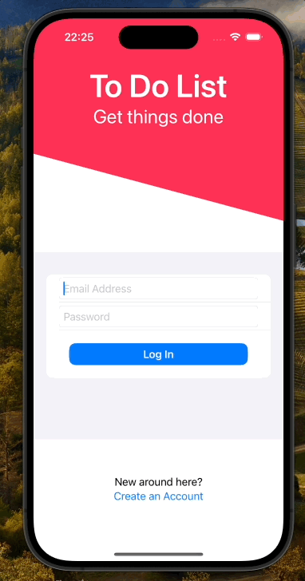
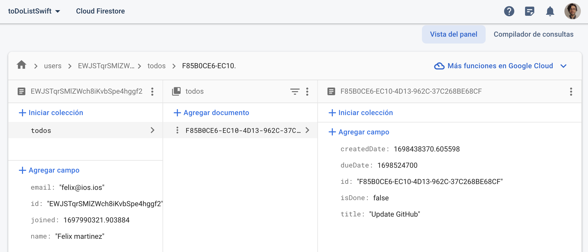

# SwiftToDoList

This is a small app with a to-do list, where you can create tasks with time and date, mark them as finished, delete tasks, can register and log in; all the user's information with his tasks are stored in Firebase.

## Description

I used for the creation SwiftUI and Firebase.

Xcode Version: v15.0

## Screenshots

### Data stored in Firebase

